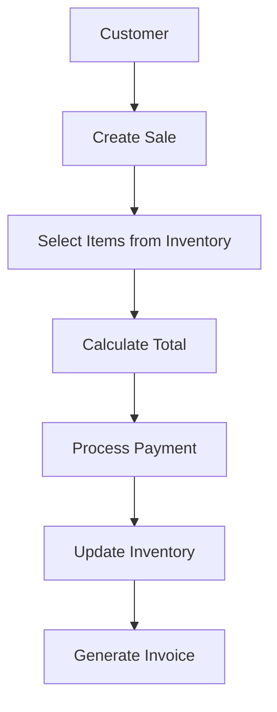
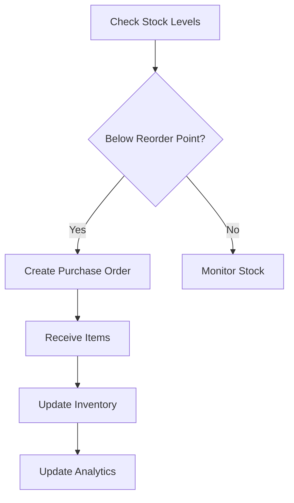
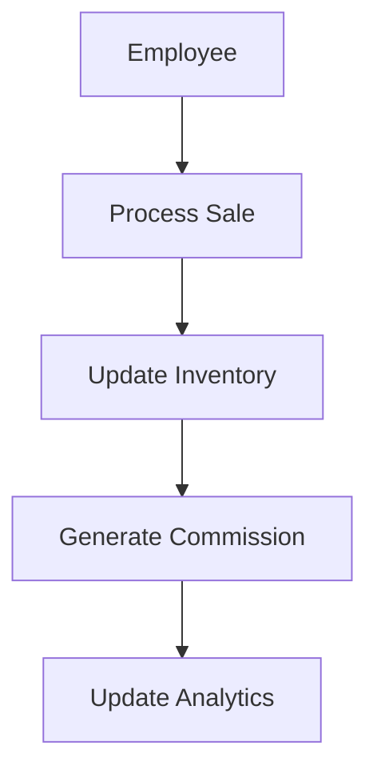

# Enterprise Resource Planning (ERP) System - Entity Relationship Documentation

## Overview
This document explains the structure and relationships of our ERP system. Think of this as a digital nervous system that connects all parts of a business - from employees and inventory to sales and finances.

## Core Entities and Their Relationships

### 1. COMPANY 🏢
The company is the root entity that owns all other entities.

**What information do we store about a company?**
- Basic Information:
  - Name
  - Address
  - Phone
  - Email
  - Website
  - Logo

**How is a company connected?**
- Contains all other entities (employees, inventory, sales, etc.)
- One company has many of each entity type
- All data is scoped to a company

### 2. EMPLOYEE 🧑‍💼
An employee represents staff members within the company.

**What information do we store about an employee?**
- Basic Information:
  - First Name
  - Last Name
  - Email (unique)
  - Phone
  - Position
  - Department
  - Start Date
  - Salary
  - Status (active/inactive)

**How is an employee connected?**

1. **Employee ↔️ Company**
   - Every employee belongs to ONE company
   - A company can have MANY employees

2. **Employee ↔️ Sales**
   - An employee can be associated with MANY sales
   - Each sale has ONE employee (sales representative)
   - Example: John processed 5 sales this month

3. **Employee ↔️ Projects**
   - An employee can work on MULTIPLE projects
   - Each project can have MULTIPLE employees
   - Example: Sarah and John both work on the Website Redesign project

### 3. INVENTORY 📦
Tracks all products and items in the company.

**What information do we store about inventory?**
- Item Information:
  - Name
  - SKU (unique identifier)
  - Category
  - Quantity
  - Price
  - Status
  - Description
  - Reorder Point

**How is inventory connected?**
1. **Inventory ↔️ Company**
   - Each item belongs to ONE company
   - A company has MANY inventory items

2. **Inventory ↔️ Sales**
   - Items can appear in MULTIPLE sales
   - Each sale can have MULTIPLE items
   - Tracks quantity and price per sale

### 4. SALES 💰
Manages all sales transactions in the system.

**What information do we store about sales?**
- Transaction Information:
  - Invoice Number
  - Customer Details
  - Employee (sales rep)
  - Date
  - Status
  - Total Amount
  - Tax
  - Notes
  - Items Sold (with quantity and price)

**How are sales connected?**
1. **Sales ↔️ Company**
   - Each sale belongs to ONE company
   - A company has MANY sales

2. **Sales ↔️ Customer**
   - Each sale is associated with ONE customer
   - A customer can have MANY sales

3. **Sales ↔️ Employee**
   - Each sale is processed by ONE employee
   - An employee can process MANY sales

4. **Sales ↔️ Inventory**
   - Each sale can include MULTIPLE inventory items
   - Each inventory item can appear in MULTIPLE sales

### 5. CUSTOMER 👥
Represents clients and customers of the company.

**What information do we store about customers?**
- Basic Information:
  - Name
  - Email
  - Phone
  - Address

**How are customers connected?**
1. **Customer ↔️ Company**
   - Each customer belongs to ONE company
   - A company has MANY customers

2. **Customer ↔️ Sales**
   - A customer can have MANY sales
   - Each sale belongs to ONE customer

## Data Flow in the System

### 1. Sales Process Flow


### 2. Inventory Management Flow


### 3. Employee-Sales Flow


## Implementation Details

### Technology Stack
```
Frontend:
- Next.js 13+ with App Router
- TypeScript for type safety
- Tailwind CSS for styling
- shadcn/ui for UI components
- React Query for data management
- React Hook Form for forms
- Zod for validation

Backend:
- Next.js API Routes
- Prisma ORM for database operations
- MongoDB for data storage
- JWT for authentication
```

### Key Features to Build

1. **Employee Management**
   - Complete employee profiles
   - Supervisor assignment
   - Project assignments
   - Dependent management
   - Salary tracking

2. **Department Operations**
   - Department creation and management
   - Location tracking
   - Employee assignment
   - Project oversight

3. **Project Management**
   - Project creation and tracking
   - Manager assignment
   - Employee hour tracking
   - Progress monitoring

4. **Reporting and Analytics**
   - Department statistics
   - Project progress reports
   - Employee performance metrics
   - Salary distribution analysis

### Security Considerations

1. **Authentication**
   - JWT-based authentication
   - Secure password handling
   - Session management

2. **Authorization**
   - Role-based access control:
     - Administrators
     - Department Managers
     - Project Managers
     - Regular Employees

3. **Data Protection**
   - Encrypted sensitive data
   - Audit logging
   - Data backup procedures

## Database Schema Evolution

As the system grows, we might need to add:
1. **Employee Extensions**
   - Skills and certifications
   - Performance reviews
   - Leave management

2. **Project Extensions**
   - Budget tracking
   - Resource allocation
   - Timeline management

3. **Department Extensions**
   - Budget management
   - Resource planning
   - Performance metrics

## Best Practices for Development

1. **Data Integrity**
   - Always maintain referential integrity
   - Use transactions for critical operations
   - Implement proper validation

2. **Performance**
   - Index frequently queried fields
   - Optimize relationship queries
   - Implement caching where appropriate

3. **User Experience**
   - Intuitive navigation
   - Responsive design
   - Clear error handling

4. **Code Organization**
   - Follow modular design
   - Implement proper error handling
   - Write comprehensive tests

## Getting Started

1. **Setup Development Environment**
   ```bash
   npm install
   npx prisma generate
   npx prisma db push
   ```

2. **Initial Configuration**
   - Set up environment variables
   - Configure database connection
   - Set up authentication

3. **First Steps**
   - Create departments
   - Add initial employees
   - Set up project structure

## Maintenance and Updates

1. **Regular Tasks**
   - Database backups
   - Performance monitoring
   - Security updates

2. **Periodic Reviews**
   - Code quality
   - Performance metrics
   - Security audits

This documentation serves as a comprehensive guide for understanding and implementing the Employee Management System. It's designed to be easily understood by both technical and non-technical team members while providing sufficient detail for development purposes.
