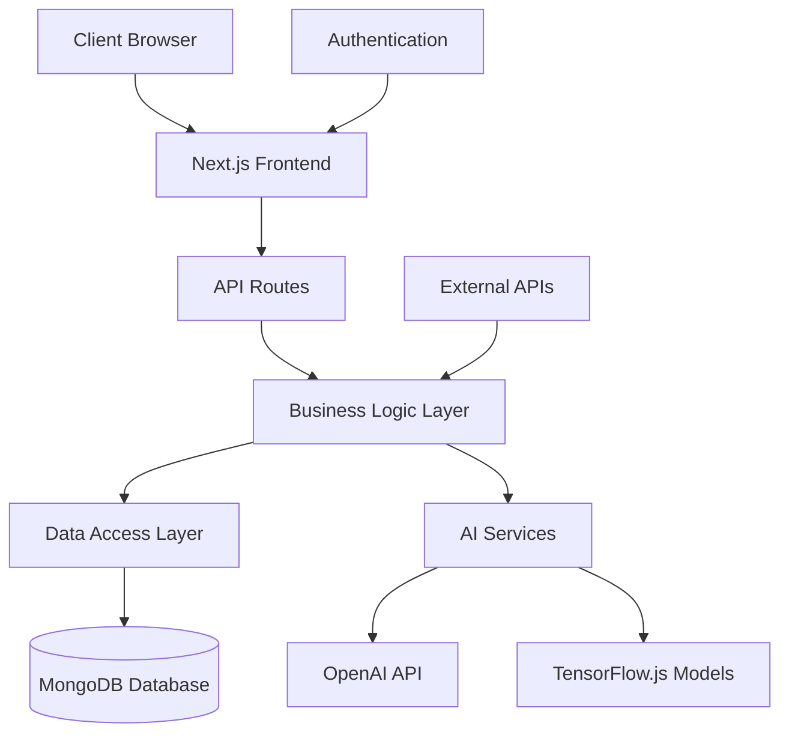

<div align="center">

# 🚀 ERP-AI

### Enterprise Resource Planning System with AI Integration

[](https://www.typescriptlang.org/)
[](https://developer.mozilla.org/en-US/docs/Web/JavaScript)
[](https://nextjs.org/)
[](https://www.prisma.io/)
[](https://www.mongodb.com/)
[](https://tailwindcss.com/)

<p align="center">
  
</p>

</div>

## 📋 Table of Contents

- [Overview](#-overview)
- [Features](#-features)
- [Tech Stack](#-tech-stack)
- [System Architecture](#-system-architecture)
- [AI Integration](#-ai-integration)
- [Installation](#-installation)
- [Usage](#-usage)
- [API Documentation](#-api-documentation)
- [Environment Variables](#-environment-variables)
- [Contributing](#-contributing)
- [License](#-license)
- [Contact](#-contact)

## 🌟 Overview

**ERP-AI** is a comprehensive Enterprise Resource Planning system enhanced with artificial intelligence capabilities. It provides businesses with a centralized platform to manage operations, resources, and data while leveraging AI for intelligent insights and automation.

> 🚧 **Note:** This project is currently in active development. Some features may be incomplete or subject to change.

<div align="center">
  
</div>

## ✨ Features

### Core Modules

- **📊 Dashboard**
  - Real-time business metrics and KPIs
  - Customizable widgets and data visualization
  - AI-powered trend analysis and forecasting

- **👥 User Management**
  - Role-based access control
  - Comprehensive user permissions
  - Multi-factor authentication
  - User activity logging

- **🏢 Organization Management**
  - Multi-company support
  - Department and team structures
  - Resource allocation

- **📦 Inventory Management**
  - Stock tracking and management
  - Automated reordering
  - Barcode/QR code integration
  - Inventory forecasting

- **💰 Finance & Accounting**
  - General ledger
  - Accounts payable/receivable
  - Financial reporting
  - Budget management

- **🔄 Workflow Automation**
  - Custom workflow creation
  - Approval processes
  - Task scheduling
  - Notification system

### AI-Enhanced Capabilities

- **🤖 Predictive Analytics**
  - Sales forecasting
  - Inventory optimization
  - Resource allocation suggestions

- **📈 Business Intelligence**
  - Automated report generation
  - Anomaly detection
  - Performance insights

- **🔍 Natural Language Processing**
  - Document analysis
  - Sentiment analysis for customer feedback
  - Conversational interfaces

## 🛠️ Tech Stack

<div align="center">

### Frontend
[](https://nextjs.org/)
[](https://reactjs.org/)
[](https://www.typescriptlang.org/)
[](https://tailwindcss.com/)
[](https://ui.shadcn.com/)

### Backend
[](https://nodejs.org/)
[](https://www.prisma.io/)
[](https://www.mongodb.com/)
[](https://next-auth.js.org/)

### AI & Machine Learning
[](https://www.tensorflow.org/js)
[](https://openai.com/)
[](https://huggingface.co/)

### DevOps & Deployment
[](https://vercel.com/)
[](https://github.com/features/actions)
[](https://www.docker.com/)

</div>

## 🏗️ System Architecture

ERP-AI follows a modular architecture designed for scalability and maintainability:



<div align="center">
  
</div>

## 🧠 AI Integration

ERP-AI leverages artificial intelligence in several key areas:

1. **Predictive Analytics**
   - Sales forecasting based on historical data
   - Inventory demand prediction
   - Resource utilization optimization

2. **Natural Language Processing**
   - Document parsing and information extraction
   - Sentiment analysis for customer feedback
   - Automated report generation

3. **Anomaly Detection**
   - Identifying unusual patterns in financial transactions
   - Detecting potential security breaches
   - Highlighting operational inefficiencies

4. **Decision Support**
   - AI-powered recommendations for business decisions
   - Risk assessment and mitigation strategies
   - Performance optimization suggestions

## 🚀 Installation

### Prerequisites

- Node.js (v18 or higher)
- MongoDB instance
- OpenAI API key (for AI features)

### Setup Instructions

1. **Clone the repository**

```bash
git clone https://github.com/repo-anuj/ERP-AI.git
cd ERP-AI
```

2. **Install dependencies**

```bash
npm install
```

3. **Set up environment variables**

Create a `.env` file in the root directory based on the `.env.example` template.

4. **Set up the database**

```bash
npx prisma generate
npx prisma db push
```

5. **Run the development server**

```bash
npm run dev
```

The application will be available at `http://localhost:3000`.

## 🖥️ Usage

### User Roles

ERP-AI supports multiple user roles with different permissions:

- **Administrator**: Full system access
- **Manager**: Department-level access with approval capabilities
- **Employee**: Limited access to relevant modules
- **Viewer**: Read-only access to specific data

### Key Workflows

1. **User Onboarding**
   - Account creation
   - Role assignment
   - Department allocation
   - Training resources

2. **Data Management**
   - Data entry and validation
   - Import/export capabilities
   - Audit trails
   - Backup and recovery

3. **Reporting**
   - Standard reports
   - Custom report builder
   - Scheduled report generation
   - Export in multiple formats

## 📚 API Documentation

ERP-AI provides a comprehensive API for integration with other systems:

- **Authentication**: JWT-based authentication
- **Data Access**: RESTful endpoints for all major entities
- **Webhooks**: Event-driven notifications
- **Batch Operations**: Bulk data processing

Detailed API documentation is available at `/api/docs` when running the development server.

## 🔐 Environment Variables

The following environment variables are required:

```
# Database
DATABASE_URL="mongodb+srv://..."

# Authentication
NEXTAUTH_SECRET="your-secret-here"
NEXTAUTH_URL="http://localhost:3000"

# OpenAI API (for AI features)
OPENAI_API_KEY="your-openai-key"

# Email (for notifications)
EMAIL_SERVER_HOST="smtp.example.com"
EMAIL_SERVER_PORT=587
EMAIL_SERVER_USER="your-email"
EMAIL_SERVER_PASSWORD="your-password"
EMAIL_FROM="noreply@example.com"
```

## 👥 Contributing

Contributions are welcome! Please follow these steps:

1. Fork the repository
2. Create a feature branch (`git checkout -b feature/amazing-feature`)
3. Commit your changes (`git commit -m 'Add some amazing feature'`)
4. Push to the branch (`git push origin feature/amazing-feature`)
5. Open a Pull Request

Please ensure your code follows the project's coding standards and includes appropriate tests.

## 📄 License

This project is licensed under the MIT License - see the [LICENSE](LICENSE) file for details.

## 📬 Contact

- **Anuj Dubey** - [GitHub](https://github.com/repo-anuj) | [LinkedIn](https://linkedin.com/in/anuj-0-dubey)
- **Project Link**: [https://github.com/repo-anuj/ERP-AI](https://github.com/repo-anuj/ERP-AI)

---

<div align="center">

Made with ❤️ by [Anuj Dubey](https://github.com/repo-anuj)

[](https://github.com/repo-anuj/ERP-AI/stargazers)
[](https://github.com/repo-anuj/ERP-AI/network/members)
[](https://github.com/repo-anuj/ERP-AI/watchers)

</div>
